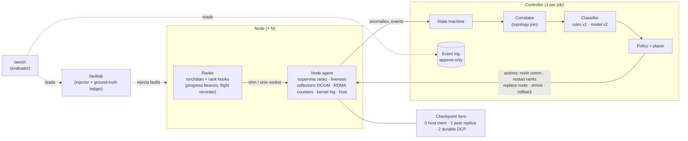

# goodput

**Cross-layer fault attribution and minimal-blast-radius recovery for multi-node LLM training.**

> **Status: pre-alpha, milestone M1 of 6.** The repository holds the design, interfaces,
> schemas and test harness. **No results have been measured yet.** This README makes no
> performance claims. Every number that appears here later will link to a run under
> [`bench/results/`](bench/results/) together with its environment manifest.

---

## The problem

In a multi-node training job, *symptoms are global and causes are local*. One bad GPU, NIC,
cable or switch port stalls a collective, and then **every rank times out the same way**.
Stock tooling handles this as follows:

- **Detection:** a watchdog timeout, measured in minutes.
- **Attribution:** none. "The first rank to report" is not the culprit.
- **Recovery:** restart the whole job from the last durable checkpoint. That pays for
  process start, CUDA init, NCCL communicator init, checkpoint load and compile warmup on
  every rank, plus the work lost since the checkpoint. It may also land the job back on
  the same broken hardware.

Published reports of large training runs describe interruptions as frequent and mostly
caused by infrastructure. See [`docs/PROJECT_BRIEF.md` §2](docs/PROJECT_BRIEF.md) for the
primary sources. Each one is verified in `docs/prior_art.md` as part of M1.

## The thesis

```
goodput        = productive_step_time / wall_time
loss per fault ≈ MTTD + MTTR + lost_work + (false_positive_rate × capacity_cost)
```

The lever is **fast, correct attribution** to the right rank *and* the right physical
component. Correct attribution is what makes small recoveries safe: re-initializing
communicators in-process, replacing one node, or restoring from a peer's in-memory
checkpoint held in a different failure domain.

The claim this repo exists to test, not assume:

> Goodput under faults is higher than with stock PyTorch tooling **because attribution is
> faster and more precise, not because we restart harder.**

## How it differs from existing tools

goodput builds on these tools and does not replace them.

| Tool | Covers well | What goodput adds |
|---|---|---|
| `torchrun` / TorchElastic | Rendezvous, restart on process failure | *Why* it failed and *where*; avoids restarting onto bad hardware |
| ProcessGroupNCCL watchdog + flight recorder | Collective timeouts; per-rank collective history | Cross-rank analysis that names the culprit, joined with hardware telemetry |
| PyTorch DCP | Sharded, reshardable checkpoints | Tier placement by failure domain; restore path chosen per fault class |
| torchft | Per-step fault tolerance through replica groups | Attribution and fabric-layer signals (complementary) |
| NVIDIA Resiliency Extension | Straggler detection, in-process restart, local checkpoints | RoCE/IB fabric attribution and topology-aware policy |
| DCGM | GPU health, XIDs, diagnostics | Correlation of GPU events with training symptoms, mapped to ranks |

The gap we claim is **cross-layer attribution**: joining PyTorch/NCCL symptoms with GPU
health *and* RDMA fabric state (port state, retransmit and timeout counters, ECN/CNP, PFC
pause) through an explicit topology model. M1 has a gate to check that this gap is real.
If it isn't, the project is re-scoped before any fault-injection code is written.

## Architecture



Design principles, taken from [`docs/ARCHITECTURE.md`](docs/ARCHITECTURE.md):

1. **Out of the data path.** If every goodput component dies, training carries on exactly as
   stock PyTorch would.
2. **Attribution before action.** No recovery action runs without a `Verdict` that carries
   evidence.
3. **Topology is a first-class input.** Every rank maps to its GPU, NUMA node, NIC/port,
   rail, switch and failure domain.
4. **Everything is an event.** Metrics are computed from the event log, never from ad-hoc
   timers.
5. **Ground truth is isolated.** The system under test (`goodput`) cannot import the fault
   ledger (`faultlab`) or the evaluator (`bench`). A test enforces this
   ([ADR-0004](docs/adr/0004-repo-layout-and-package-boundaries.md)).

## Evidence standard

This project will be judged by how rigorous its evidence is, so these rules are written
into the code and the review process:

- **No number without a run.** Every latency, MTTR, accuracy or goodput figure links to
  `bench/results/<run_id>/` with its environment manifest. Simulator projections and
  literature values are labelled as such.
- **Real, induced or synthetic.** Every fault and every telemetry sample carries one of
  these labels, and the schemas enforce it. Detection results on synthetic GPU faults
  are never presented as evidence about real hardware.
- **Baselines that aren't strawmen.** B0 is stock `torchrun` with synchronous DCP. B1 adds
  async DCP. B2 (optional) uses NVIDIA Resiliency Extension components. Checkpoint
  intervals come from Young/Daly using measured checkpoint cost.
- **Statistics.** Each fault class gets many trials with seeded, randomized targets.
  Percentiles and bootstrap confidence intervals are reported, and failures are listed one
  by one. See [`docs/EVALUATION.md`](docs/EVALUATION.md).
- **Recovery must be correct.** A sample ledger (no sample duplicated or skipped), a
  loss-trajectory comparison against an uninterrupted run, and optimizer and RNG state
  checks.

## Results

*None yet.* The planned outputs are:

- an MTTD CDF for each fault class;
- stacked MTTR bars broken into phases for each recovery path;
- a goodput timeline with fault markers for goodput vs B0 and B1;
- a confusion matrix;
- the steady-state overhead distribution.

Targets and the baseline for each are in [`docs/PROJECT_BRIEF.md` §6](docs/PROJECT_BRIEF.md).
They are hypotheses to be revised once baseline measurements exist.

## Repository layout

```
goodput/                 system under test (Python package)
  schemas/               versioned pydantic models: Event, TelemetrySample, FaultInjection,
                         Incident, Verdict, Action, CheckpointManifest, Topology
  rank/                  in-process hooks: progress beacon, recovery entry points
  agent/                 node agent: liveness, collectors (DCGM, RDMA, kernel log, host)
  controller/            state machine, correlator
  signals/               flight-recorder cross-rank analysis, classifier
  policy/                Verdict -> Action, guards, escalation ladder
  ckpt/                  tiered checkpoint catalog (host / peer / durable)
  topology/              discovery -> artifacts/topology.json
  sim/                   goodput simulator (projections, labelled)
  export/                Hugging Face dataset builder
faultlab/                fault injector + ground-truth ledger (separate package)
  scenarios/             declarative fault scenarios (YAML)
  mechanisms/            signals, link state, clocks/power, storage, DCGM injection
  interposer/            LD_PRELOAD NCCL/CUDA interposer (C17)
bench/                   evaluator: experiment runner, metrics, reports
  scenarios/             experiment definitions
  results/<run_id>/      raw results (gitignored) + committed summaries
configs/                 example configs (real host lists are *.local.yaml, gitignored)
dashboards/              Grafana JSON
docs/                    brief, architecture, fault matrix, evaluation, milestones, ADRs
tests/                   unit/ integration/ (CPU, gloo) · gpu/ · multinode/ · fixtures/
```

## Getting started

The whole control plane is developed and tested **on CPU**. You need Linux, Python ≥ 3.11
and [`uv`](https://github.com/astral-sh/uv). No GPU, CUDA or torch is required.

```bash
make setup      # .venv with dev deps + pre-commit hooks
make check      # ruff + mypy --strict + CPU tests
make help       # every target
```

Real experiments need an NVIDIA multi-GPU cluster with an RDMA fabric (InfiniBand or
RoCE). The hosts must be listed in `configs/hosts.local.yaml` and described in
[`docs/ENVIRONMENT.md`](docs/ENVIRONMENT.md). faultlab refuses to act on any host that is
not on the list.

## Roadmap

| Milestone | Scope | Status |
|---|---|---|
| **M1** | Workload harness, B0/B1 baselines, topology discovery, env manifest, prior-art gate | In progress: skeleton only |
| M2 | faultlab: injection harness, ground-truth ledger, safe revert | Not started |
| M3 | Flight-recorder signature capture, culprit-rank attribution | Not started |
| M4 | Telemetry pipeline, cross-layer (GPU/NIC/fabric) correlation | Not started |
| M5 | Topology-aware recovery, tiered checkpointing, goodput runs | Not started |
| M6 | Simulator, write-up, public release | Not started |

Details and exit criteria are in [`docs/MILESTONES.md`](docs/MILESTONES.md). Known open
issues in the design are in [`docs/OPEN_QUESTIONS.md`](docs/OPEN_QUESTIONS.md).

## Documentation

| Doc | Contents |
|---|---|
| [PROJECT_BRIEF](docs/PROJECT_BRIEF.md) | Problem, positioning, thesis, targets, scope tiers, risks |
| [ARCHITECTURE](docs/ARCHITECTURE.md) | Components, state machine, schemas, failure semantics |
| [FAULT_MATRIX](docs/FAULT_MATRIX.md) | 18 fault classes: mechanism, signals, verdict, recovery |
| [EVALUATION](docs/EVALUATION.md) | Metric definitions, baselines, protocol, reporting |
| [MILESTONES](docs/MILESTONES.md) | M1–M6 deliverables and exit criteria |
| [ADRs](docs/adr/) | Architecture decisions and their status |
| [OPEN_QUESTIONS](docs/OPEN_QUESTIONS.md) | Contradictions and gaps to resolve |

## Contributing, security, licence

- [CONTRIBUTING.md](CONTRIBUTING.md) covers development workflow, conventions, the evidence
  rules and the DCO sign-off.
- [SECURITY.md](SECURITY.md) covers vulnerability reporting and the safety model for fault
  injection.
- The code is licensed under the [Apache License 2.0](LICENSE).
